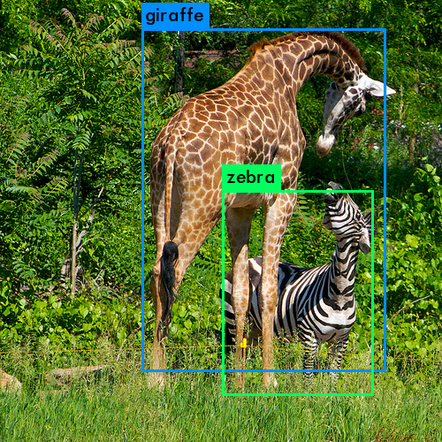

LightNet* is a minimize inference neural network fork from Darknet. I got a simple network running on lightweight mobile devices by hacking Darknet. Making networks running on mobile devices let them more useful.  

For now it's just a YOLOv3 object detection network tiny version running with high FPS (22ms/52mAP), and everything unrelated was dropped, including cuda computing, trainning period and some layers.

### Demo
If you want a simple object detection solution, try it by building C code and running python demo. The detect function return a struct containing object names, probability and bounding boxs' axis. It works if you got predicition images like this,

### Features

- Small,  the core' size limited to 200kb
- Fast, written in C with performance optimization
- Hackable, thanks to the tiny size and understand it is easy
- Easy install, no external deps and just build by makefile in few seconds

### Future work

- Add more models and tasks
- Maybe NNPACK make it faster
- Make it easily for hacking 
- Wait for deep learning suitable for engineer hacking ⏱️⏱️⏱️

###  Acknowledgement

Darknet is a fantastic project, the author also created YOLOnet. If you want hack it and have some fun, here are some useful links:

- Darknet official repo: [Convolutional Neural Networks ](https://github.com/pjreddie/darknet)
- Darknet official site: [Darknet: Open Source Neural Networks in C](https://pjreddie.com/darknet/)
- YOLOv3: [Real-Time Object Detection](https://pjreddie.com/media/files/papers/YOLOv3.pdf)

